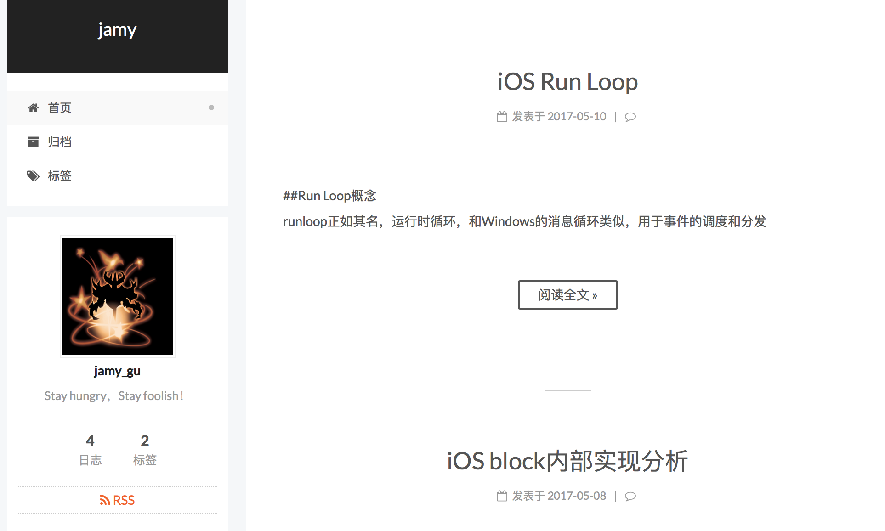
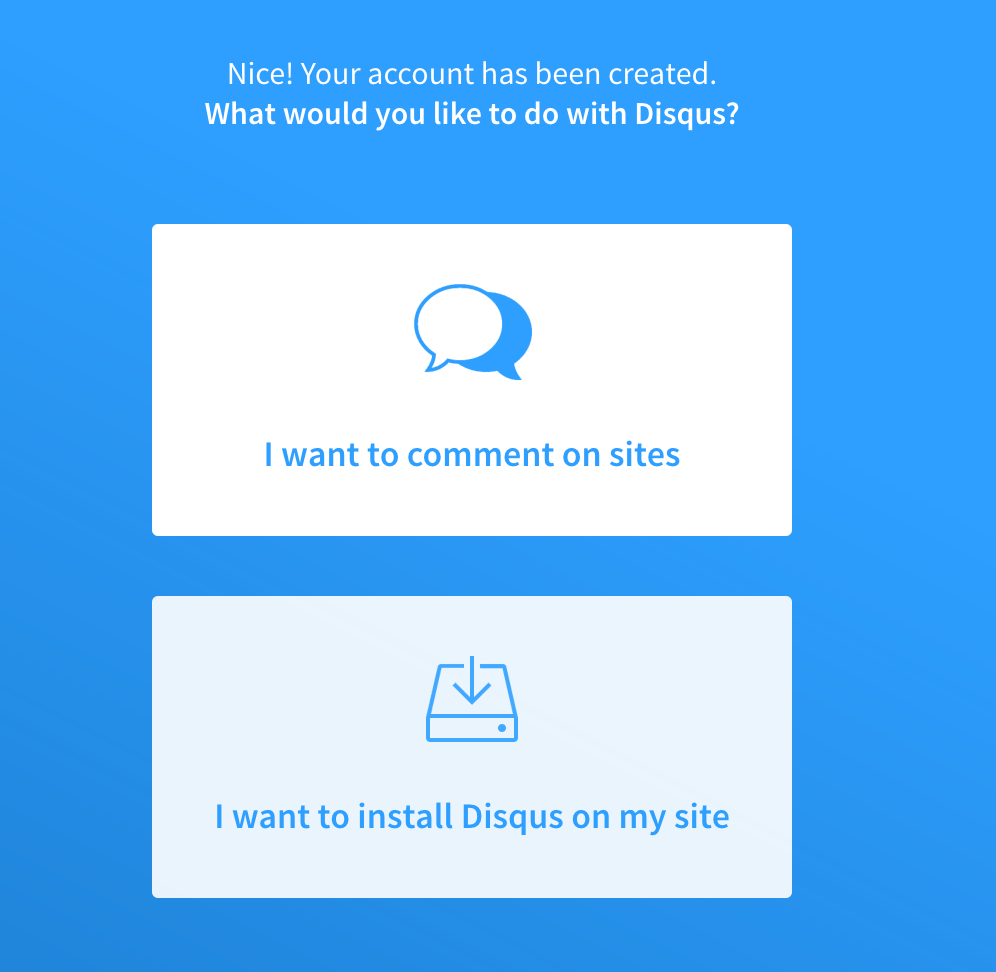
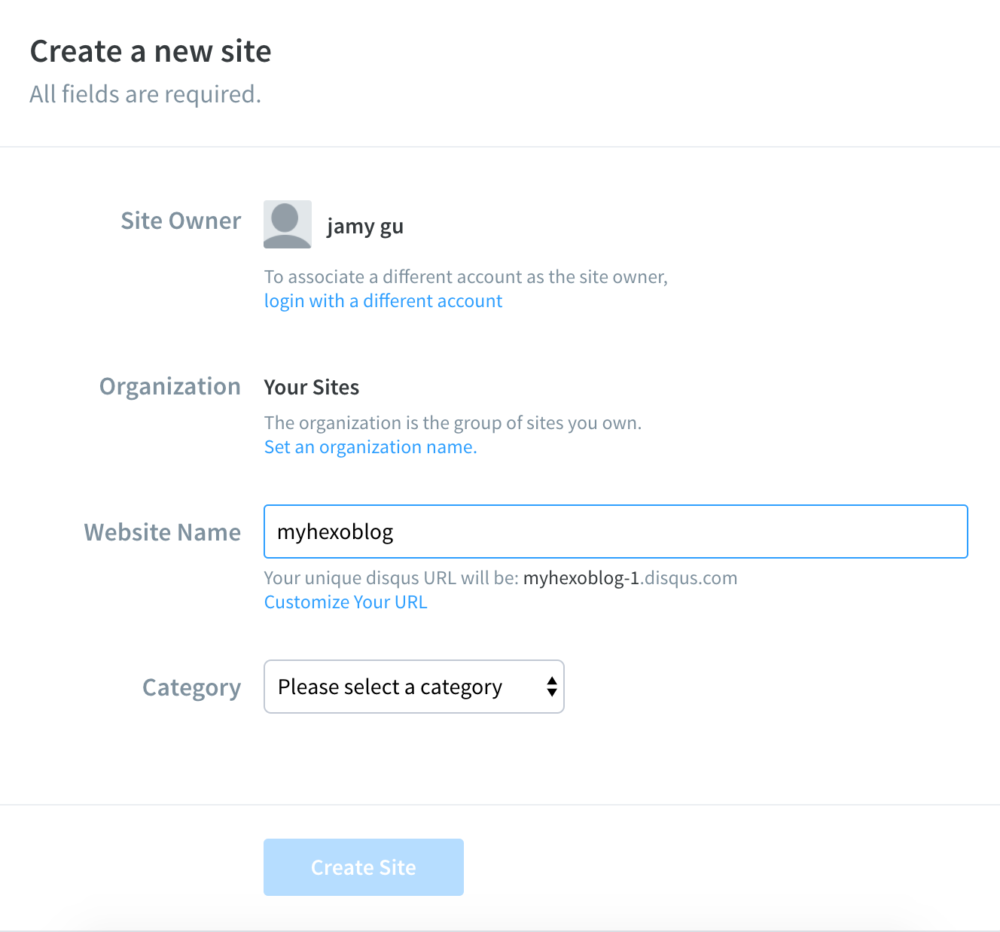

## hexo+next+gitHub构建简单博客

一直想有个地方可以记录自己平时的所见所得，发现以前还是太年轻了，以为维护成本很高，没有尝试就放弃了，看了同事和公司的博客，于是决定自己动手也搞一个玩玩。
<!-- more -->

hexo是一款基于Node.js的静态博客框架[gitHub链接地址](https://github.com/hexojs/hexo)，如果你想了解更多的话可以直接看代码，下面简单说说搭建我这个博客的步骤吧。

## 环境配置
* 安装Node，hexo是基于Node.js的。直接到[官网](https://nodejs.org/en/)下载最新的安装包安装即可。
* 安装Git,一般MAC电脑自带安装。
* 拥有一个GitHub账号（这个没有的话就不要看下面的了吧。。。）

## hexo
hexo是基于npm包管理的，我们可以直接通过命令行的方式去获取：

```
$ sudo npm install -g hexo
```
如果是使用`hexo3`来安装的话，在执行`hexo s`命令会提示找不到命令之类的，这时候需要单独的运行下面的命令：

```
$ npm install hexo-server --save
$ npm install
```

安装完毕后执行以下命令：

```
$ hexo init blog
$ cd blog
$ npm install
$ hexo g  // 生成静态文件，会在当前目录下生成一个新的叫做public的文件夹
$ hexo s // 启动本地web服务，可以查看博客的预览
```
构建完毕后我们可以看到命令行提示可以打开http://localhost:4000/本地链接，这样就生生成了一个简单的博客框架。
另外hexo还有几个重要的命令：

```
$ hexo new "postName" #新建一个文章
$ hexo new page "pageName" #新建一个页面
```

## hexo主题配置

hexo有很多的主题，在GitHub上可以直接搜索`hexo theme`查看现在很多人在使用的主题 [点击这里试试](https://github.com/search?o=desc&q=hexo+theme&s=stars&type=Repositories&utf8=✓)。
hexo自带的是lanscape,我们这里使用`next`主题。在刚才初始化的目录下输入下面的命令：

```
$ git clone https://github.com/iissnan/hexo-theme-next.git themes/next
```

然后就是配置hexo目录下的`_config.yml`文件：

```
$ theme: next
```
保存文件，然后执行`hexo g`,`hexo s`，打开本地链接[localhost:4000](localhost:4000)查看效果：



## gitHub配置
在GitHub上新建一个`repository`,注意项目的名称一定要是你的GitHub账号名称加上`github.io`，比如我的`svenJamy.github.io`。然后在电脑上配置下`SSH key`，
[具体操作可以查看GitHub文档](https://help.github.com/articles/connecting-to-github-with-ssh/)。这里就简单的介绍下：

* 打开终端，输入以下命令：
 ```
 $ ssh-keygen -t rsa -b 4096 -C "your_email@example.com"
 ```
 中间会提示你输入密码，就是你登入GitHub的密码，然后是保存`key`的路径:
 ```
 $ Enter a file in which to save the key (/Users/you/.ssh/id_rsa): [Press enter]
 ```
 如果你电脑上已经使用的`gitlab`或者其他的，你可以将它保存为`id_rsa_github`。
 
* 如果您使用的是MacOS Sierra 10.12.2或更高版本，则需要修改〜/ .ssh / config文件，以自动将密钥加载到ssh代理中，并将密码存储在钥匙串中，如下是我电脑的配置:

```
# gitlab
Host gitlab.com
    HostName gitlab.com
    PreferredAuthentications publickey
    IdentityFile ~/.ssh/id_rsa
    
# github
Host github.com
    HostName github.com
    PreferredAuthentications publickey
    IdentityFile ~/.ssh/id_rsa_github
```

* 把创建的`SSH key`添加到GitHub账号中去。先执行下面命令，拷贝到剪切板：
```
$ pbcopy < ~/.ssh/id_rsa.pub
```
然后在GitHub上点击你的`profile`-> `setting`-> `SSH` -> `new SSH`.把剪切板的内容粘贴到里面保存即可：


* 测试`SSH key`是否添加成功。输入以下命令：

 ```
 $ ssh -T git@github.com
 ```
 提示输入创建`SSH key`时的密码（GitHub登入密码）,然后出来下面的提示，说明创建成功。
 ```
 Hi username! You've successfully authenticated, but GitHub does not
provide shell access.
 ```
* 配置`_config.yml`文件。在配置文件的最后面替换以下几行：

```
deploy:
  type: git
  repo: git@github.com:githubname/githubname.github.io.git
  branch: master
```

* 最后输入`hexo d`命令，就可以成功部署到GitHub上啦！！！在浏览器中输入`githubname.github.io`可以查看你自己的专属博客。

## NEXT主题配置
官网有介绍大部分设置，具体的可以参考[官网](http://theme-next.iissnan.com/theme-settings.html)。

* 语言设置
  `hexo`创建的博文默认是德文，看的一脸懵逼👀，需要在两个地方配置下语言：在根目录下的`_config.yml `和`/themes/next/_config.yml `分别加上下面一行：
  
  ```
  $ language: zh-Hans
  ```
  执行下本地预览命令，博客的语言恢复成中文了。
  
* 设置评论插件Disqus
在[官网](https://disqus.com/)注册一个账号。登录后，点击首页的 GET STARTED 按钮，之后选择 I want to install Disqus on my site 选项，就会看到下面的界面：


在下面页面中进行如下配置，注意website Name是唯一标识符，这个name要在后面的设置中用到，请务必记住！！！

完成之后再`./themes/next/__config.yml`中设置如下几行：

```
disqus:
  enable: true
  shortname: website name
  count: true
```
然后在根目录下hexo的`__config.yml`文件加上下面一行：

```
disqus_shortname: website name
```
最后在发布下，就可以看到你的博文下面有对应的disqus评论区了，是不是很简单~~~
更多的主题配置可以参考下官网，比如分类，打赏等等。。。

## 配置域名

* 首先在阿里云或者腾讯云上购买自己的域名；
* 在你的域名注册提供商那里配置DNS解析，获取GitHub的IP[地址](https://help.github.com/articles/setting-up-an-apex-domain/)，进入source目录下，添加CNAME文件：

```
$ cd source/
$ touch CNAME
$ vim CNAME # 然后输入你的域名
$ git add CNAME
$ git commit -m "add CNAME"

```
注意一定是添加到source目录下，不是根目录下，完成之后重新部署一下，刷新GitHub就能看到效果啦。

## 添加插件
可以通过下面的命令来添加sitemap和feed插件：

```
 npm install hexo-generator-feed
 npm install hexo-generator-sitemap
```
修改_config.yml，增加以下内容：

```
//# Extensions
Plugins:
- hexo-generator-feed
- hexo-generator-sitemap
#Feed Atom
feed:
  type: atom
  path: atom.xml
  limit: 20
#sitemap
sitemap:
  path: sitemap.xml
```

## about页面

在根目录下执行下面命令：

```
 hexo new page "about"
```
然后在对应的md文件添加对应的简介即可。


## comment

之前用的是disqus，但是很容易被墙，所以后面换成了gitment，具体的操作可以见作者的这篇博文[这里](https://zonghongyan.github.io/2017/06/29/201706292034/)。有一点需要注意的是，如果你和我一样配置了自己的域名，在auth app的时候home URL和call back URL一定要填写自己的域名，不能是之前GitHub的地址，比如xxx.github.io。其他的按作者的配置走既可。